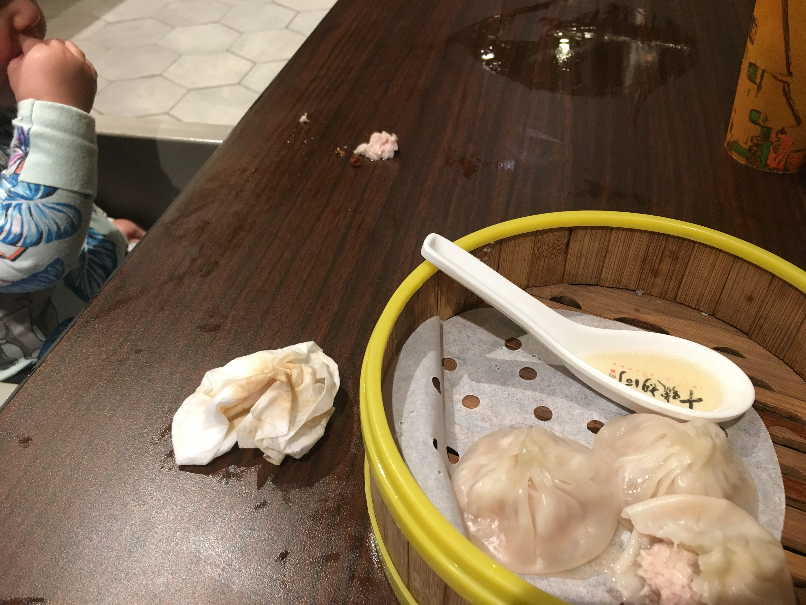

At most meals, if the food we're eating is bland, I give the baby a little bit of it. More often the case, baby is curious, then demands some of whatever we're eating. So we've been conditioned to just give her a little bit, and she'll devour it down.

For example, today at lunch: We went to the food court/hawker centre at Lot 10, a popular spot in a busy part of KL. I've been wanting to try out the dim sum stall there. I ordered chee cheong fun (meat wrapped in a rice noodle wrapper) and some xiao long bao, aka soup dumplings.

Now, soup dumplings have freaking hot broth inside them, so you can't just give a baby a dumpling. So through trial and error, here is the KLean Plate Club guide to feeding your child soup dumplings.

1. Put a soup dumpling on your spoon.
2. Bite a hole in the dumpling. Let the broth spill onto the spoon. The broth is yours.
3. Take the dumping and tear it apart with your fingers.
4. Give the baby the wrapper to eat.
5. Realize that the meat part is also baby friendly, if you are feeding baby an omnivore diet. Tear meat apart with fingers.
6. Lick your own fingers.
7. Feed baby torn meat alongside wrapper.
8. Enjoy watching baby eat deconstructed soup dumpling. Take video and send to her father.
9. Repeat steps 1-7.
10. Despair that baby has deposited part of deconstructed soup dumpling on the floor.
11. Save the last soup dumpling for yourself and enjoy.
